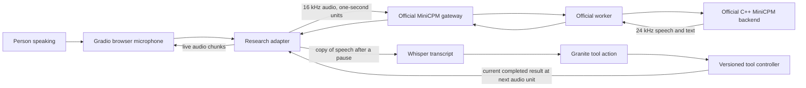

# Native live speech and tool experiment

## Research question

Can a person keep speaking with MiniCPM while it speaks, correct a pending tool request, and hear an answer grounded in the **current** tool result? The earlier controlled notebook submitted complete recordings one turn at a time. This notebook keeps a single live MiniCPM session open for the full conversation.

The model's speech input, listen/speak decision, and speech output use OpenBMB's [audio Realtime API](https://github.com/OpenBMB/MiniCPM-o-Demo/blob/main/docs-app/content/docs/en/realtime-api/audio.md). Whisper Tiny and Granite 350M see a duplicate microphone stream for our tool controller. They do not replace the model's own hearing or voice.

## Why an extension is needed

The official audio protocol accepts repeated `input.append` audio and returns `listen`, `text`, and `audio` deltas. It does not define a way to deliver an external tool result into an already running audio session. Our pinned extension, [`fixtures/realtime-tool-context.patch`](../fixtures/realtime-tool-context.patch), adds a bounded `input.tool_context` string. The gateway and worker pass it unchanged; the C++ backend checks its type and length, evaluates it before the next unit's audio embeddings, and sends `tool_context.evaluated` with the unit number and success flag. This event means the C++ model call completed with that text. It is not evidence that the model used the fact correctly in speech.

Only the C++ backend is patched. The official gateway and worker are checked out at `47709a9210dfd71afa76c058e017fc8c4db5c8d2`; the official C++ backend is checked out at `873056743b74e1a4ce5dcf7290e2298428e214db`. The adapter tag is `v0.1.25`. The notebook records these revisions and the extension hash in `run_manifest.json`. Granite is loaded from a local Hugging Face snapshot so a missing optional `additional_chat_templates` directory cannot stop tokenizer initialization.

## What happens during a correction

The person says “Where is the robotics seminar?” A pause commits that utterance to Whisper and Granite. Granite requests `room_lookup` and the controller starts version 1. Before the deliberately delayed result arrives, the person says “Actually, the vision seminar.” Granite should amend the pending request to version 2. The controller rejects a late version 1 result. At the next one-second MiniCPM audio boundary, only the current C314 fact may enter `tool_context`. The backend acknowledges that evaluation, then the person judges the spoken answer. The five-second room delay is a fixed experiment condition, not the lookup's normal speed.

The microphone keeps recording while native speech deltas are offered to the browser. The adapter measures input backlog and estimates capture during outbound audio. Browser playback lacks a completion receipt, so the participant also records whether MiniCPM was actually audible while they spoke.

The first exported live trial is analyzed in [live_trial_20260928.md](live_trial_20260928.md). It exposed two adapter bookkeeping errors and an avoidable playback gap. The notebook now sends real WAV bytes to Gradio without injecting a second of silence whenever MiniCPM has not produced the next chunk. The saved `speaker_combined.wav` joins native chunks for comparison, and cell 13 prints a reproducible timing report. MiniCPM itself sometimes produced one second of speech more than one second after the prior chunk; the adapter cannot remove those source gaps without adding playback delay. The official audio protocol does not promise a `response.done` for each input unit, so finalization uses the pinned backend's numbered response IDs and the tool acknowledgement instead.

## Kaggle sequence

1. Run the adapter install and code checks without GPU. Run the CPU echo page for at least 15 seconds. Confirm that microphone capture and playback work through the Kaggle share link and that the reported media-to-wall-time pace is at least 90%. Close the echo page. A slower path cannot establish a real-time result and needs another transport before GPU testing.
2. Enable T4 GPU. Kaggle may restart Python; rerun the adapter install. Attach the GGUF model dataset and a verified saved runtime bundle if available. The first C++ build requires CUDA tools and may run during a GPU session even though compilation itself uses CPU. Save `/kaggle/working/minicpm_official_runtime_sm75` as notebook output; attach it next time to skip recompilation.
3. Start the official backend, worker, and gateway. GPU 0 holds native MiniCPM. GPU 1 holds Whisper Tiny and Granite when available. The notebook confirms each service's health and worker registration before opening the human UI.
4. Press **Start live session**. Initialization runs in the background. After status says **running**, click the record control **inside the microphone panel**. The former Begin button was removed because it did not reliably start browser recording. You can pause the microphone and resume within the same model session. Speak the correction scenario, then ask another question while the assistant is audible. Stop the microphone in its panel, then press **Stop and finish** after listening to the final speech. A later Start creates a fresh native and tool session while keeping the loaded models and server.
5. Save the exact words heard, the correction attempted, and whether there was audible overlap. Download the final run ZIP. A Gradio 504 can be a tunnel failure; inspect local status and logs before interpreting it as a model failure.

The official realtime session has a 600-second limit. The notebook uses one continuous session within that limit. If input backlog exceeds 12 seconds, the adapter marks the run failed and retains all collected evidence rather than hiding the delay. The backend is launched with an explicit 4096-token context because the first exported run showed its duplex sliding-window logic receiving `n_ctx=0` when this argument was omitted.

## Files and interpretation

Each run is in `/kaggle/working/duplex_voice_runs/<run_id>/`, with each conversation in `live_sessions/<session_id>/`.

| File | What it shows |
| --- | --- |
| `microphone.wav`, `input_*.wav` | Received speech and ordered native audio units. |
| `utterance_*.wav` | Speech boundaries sent to Whisper for the tool sidecar. |
| `speaker_*.wav`, `speaker_combined.wav` | Native MiniCPM audio deltas saved for replay. |
| `live_events.jsonl` | Microphone, tool, context ACK, model text, audio, and timing events. |
| `controller.jsonl` | Versioned requests, accepted results, and superseded results. |
| `live_manifest.json`, `live_summary.json` | Settings, timing, counts, and final status. |
| `human_verdicts.jsonl` | The participant's judgment and exact words heard. |
| `minicpm_backend.log`, `official_worker.log`, `official_gateway.log` | Native and official service diagnostics. |
| `run_manifest.json` | Revisions, patch hash, model path, and GPU placement. |

A successful *tool mechanism* requires a current versioned result, a `native_audio_sent` event with that result's ID, and `tool_context.evaluated` for the same unit. A successful *spoken answer* additionally requires that the assistant's later speech uses the current fact and that the human confirms hearing it. Tool selection alone is not a successful outcome.

The revised Python adapter and notebook are locally checked. Its playback behavior and spoken answers still require a new Kaggle human trial. The prior run remains a failed quality trial even though its tool evaluation was confirmed in backend logs.
